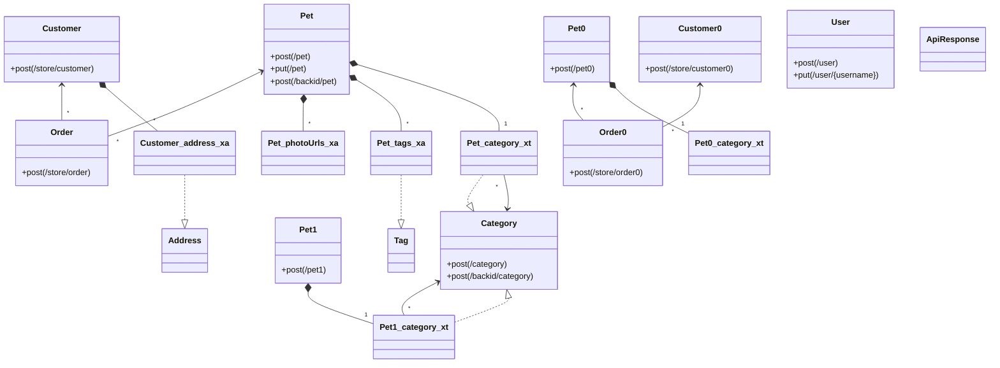
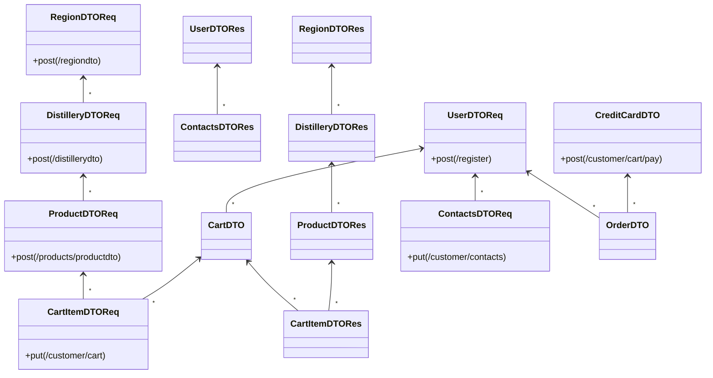
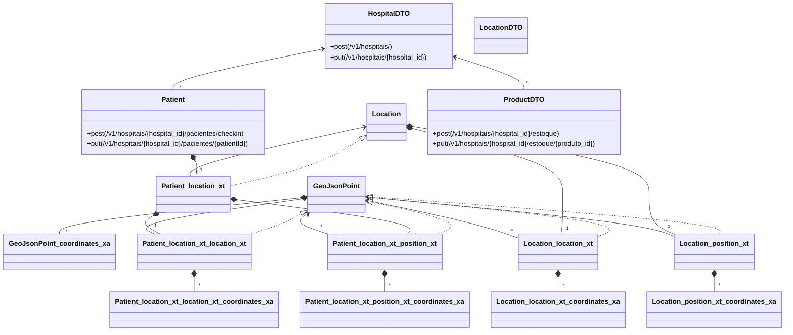

# Test Data Generation for APIs - System Tests

This project contains the system and integration tests of *Test Data Generation for APIs* (TDG).
Includes the required test classes, result files and the SUT projects,
along with an additional project (to convert into module) to evaluate the mutation
score of the tests for one of the SUTs.

## Systems Under Test (SUTs)

- Swagger Petstore (`swagger-petstore-main-fork`).
  This is a detached fork of https://github.com/swagger-api/swagger-petstore at v1.0.17 (2022-09-30) with some additions
- Market (`swagger-market-fork`).
  This is a detached fork of https://github.com/aleksey-lukyanets/market (2022-02-07) with some additions
- Gestao Hospital (`swagger-gestaoHospital-fork`). 
  This is a detached fork of https://github.com/ValchanOficial/GestaoHospital (2023-07-05) with some additions

## Structure of this project

- Module `st-tdg-test`:
  - Java tests (`src/test/java`) for each SUT.
  - Files for test result comparison (`src/test/resources`)
- A folder for each of the SUTs that are evaluated in this replication package.
- A folder `setup` with scripts to execute each SUT (backend and databases).
- Module `st-tdg-eval`: To evaluate the effectiveness of the test data my measuring
  the mutation score of the tests using PIT (pitest.org).

## How to execute the System Tests

All experiments are enclosed in the Java tests. 

To run the tests of a SUT in your local development environment:
  - Ensure that the port that uses the SUT is not used by other SUT
  - Run the server from the `setup` folder and wait until it is up
  - Execute the tests in the namespace that corresponds with the project
  - To execute from maven (e.g. for the petstore): `mvn -pl st-tdg-test` 

Port reservation and endpoints: To avoid conflicts when running in local,
different host port are reserved for each SUT.
Below are the ports and the main endpoint urls to check that SUTs are working:
  - Petstore: 8081:8080 (api) |
    [api example](http://localhost:8081/api/v3/pet/findByStatus?status=available) |
    [swagger-ui](http://localhost:8081/) |
    [api-docs](http://localhost:8081/api/v3/openapi.json)
  - Market: 8082 (web), 8083 (api), 8084 (db)
    [api example](http://localhost:8083/products) |
    [swagger-ui](http://localhost:8083/swagger-ui/index.html) |
    [api-docs](http://localhost:8083/v2/api-docs)
  - Gestao Hospital: 8085:8080 (api), 8086:27017 (default mongo) (db) |
    [api example](http://localhost:8085/v1/hospitais/) |
    [api-docs](http://localhost:8085/v2/api-docs)

The whole sequence of tests for all SUTs is run when executed in CI

## How to evaluate the mutation score

At `st-tdg-eval` run this maven command:
```
mvn test-compile org.pitest:pitest-maven:mutationCoverage
```

Test results are in the `target` folder, and mutation report in `target/pit-reports`

## Graphical TDM models

- Swagger Petstore (src/test/resources/petstore/schema-petstore.md)



- Market (/src/test/resources/market/schema-marketWithoutArrays.md)



- Gestao Hospital (src/test/resources/gestaoHospital/schema-hospital.md)


