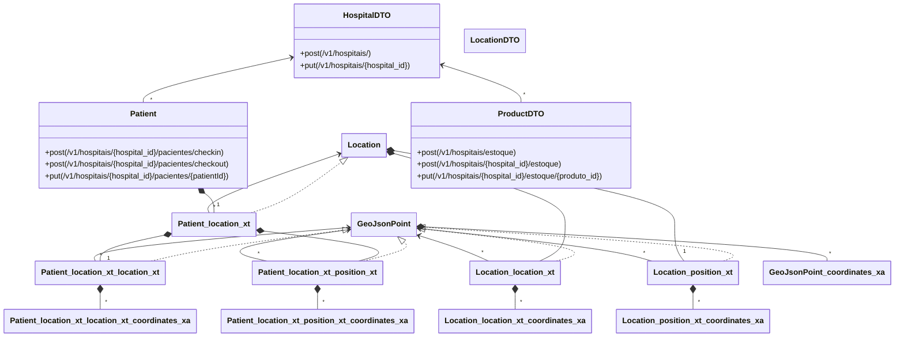

[](https://github.com/giis-uniovi/tdrules-st-tdg/actions)
[](https://giis-uniovi.github.io/tdrules-st-tdg)

# Test Data Generation for APIs - System Tests

This project contains the system and integration tests of *Test Data Generation for APIs* (TDG).
Includes the required test classes, result files and the SUT projects,
along with an additional module to evaluate the mutation
score of the tests for one of the SUTs.

## Systems Under Test (SUTs)

- Swagger Petstore (`sut-petstore` folder).
  This is a detached fork of https://github.com/swagger-api/swagger-petstore at v1.0.17 (2022-09-30) with some additions
- Market (`sut-market` folder).
  This is a detached fork of https://github.com/aleksey-lukyanets/market (2022-02-07) with some additions
- Gestao Hospital (`sut-gestaoHospital` folder). 
  This is a detached fork of https://github.com/ValchanOficial/GestaoHospital (2023-07-05) with some additions

## Structure of this project

- Module `st-tdg-test`:
  - Java tests (`src/test/java`) for each SUT.
  - Files for test result comparison (`src/test/resources`)
  - Clasess `*Petstore0*` contain some commented examples to illustrate
    some details of the TDG approach.
  - There is a common base class for all tests (`BaseAll`) and 
    Each namespace has an additional base class
    with the particular configuration of each SUT.
- A folder for each of the SUTs that are tested in this projects.
- A folder `setup` with scripts to run each SUT (backend and databases).
- Module `st-tdg-eval`: To evaluate the effectiveness of the test data my measuring
  the mutation score of the tests using PIT (https://pitest.org/).

## How to execute the System Tests

The tests are in the `st-tdg-test` module.

To run the tests of a SUT in your local development environment:
  - Ensure that the port bindings of each SUT are not used by other application
  - Run the server from the `setup` folder and wait until it is up
  - Execute the tests in the namespace that corresponds with the SUT
  - To execute this module from maven: `mvn -pl st-tdg-test test` 

Port reservation and endpoints: To avoid conflicts when running in local,
different host port are reserved for each SUT.
Below are the ports and the main endpoint urls to check that SUTs are working:
  - Petstore: 8081:8080 (api) |
    [api example](http://localhost:8081/api/v3/pet/findByStatus?status=available) |
    [swagger-ui](http://localhost:8081/) |
    [api-docs](http://localhost:8081/api/v3/openapi.json)
  - Market: 8082 (web), 8083 (api), 8087 (db)
    [api example](http://localhost:8083/products) |
    [swagger-ui](http://localhost:8083/swagger-ui/index.html) |
    [api-docs](http://localhost:8083/v2/api-docs)
  - Gestao Hospital: 8085:8080 (api), 8086:27017 (default mongo) (db) |
    [api example](http://localhost:8085/v1/hospitais/) |
    [api-docs](http://localhost:8085/v2/api-docs)

The whole sequence of tests for all SUTs is run when executed in CI

## How to evaluate the Mutation Score

The tests are located in the `st-tdg-eval` module.
Run this maven command:
```
mvn -pl st-tdg-eval test-compile org.pitest:pitest-maven:mutationCoverage
```

Test results of the module are in the `target` folder, 
and the mutation report in `target/pit-reports`

## Graphical TDM models

- Swagger Petstore 
([open in mermaid.live](https://mermaid.live/edit/?code=https://github.com/giis-uniovi/tdrules-st-tdg/blob/main/st-tdg-test/src/test/resources/petstore/schema-petstore.md))


- Market 
([open in mermaid.live](https://mermaid.live/edit/?code=https://github.com/giis-uniovi/tdrules-st-tdg/blob/main/st-tdg-test/src/test/resources/market/schema-testMarket.md))


- Gestao Hospital 
([open in mermaid.live](https://mermaid.live/edit/?code=https://github.com/giis-uniovi/tdrules-st-tdg/blob/main/st-tdg-test/src/test/resources/gestaoHospital/schema-hospital.md))


